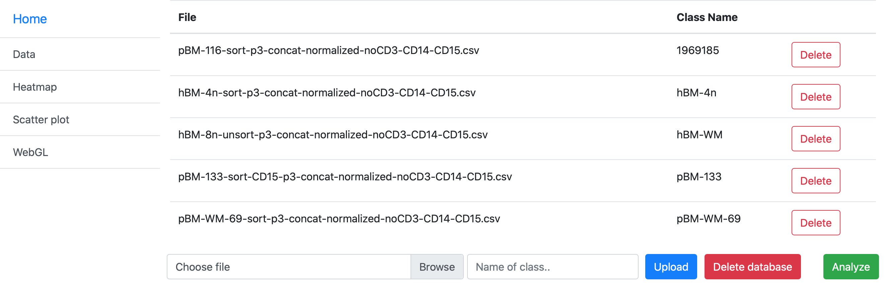
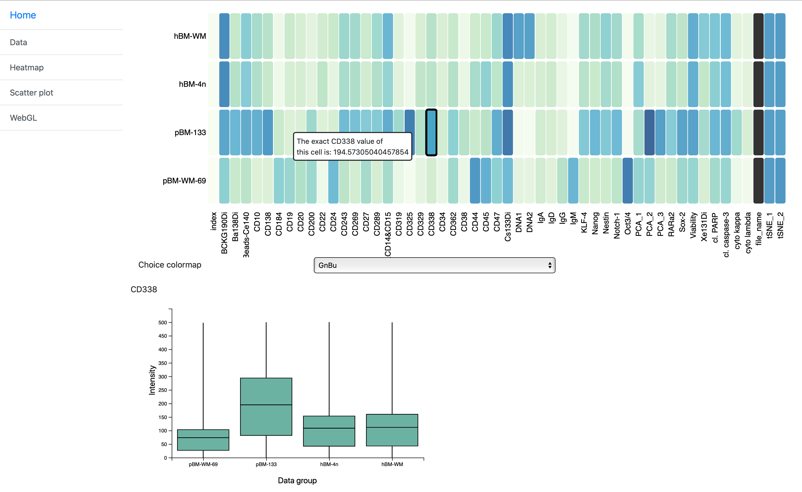
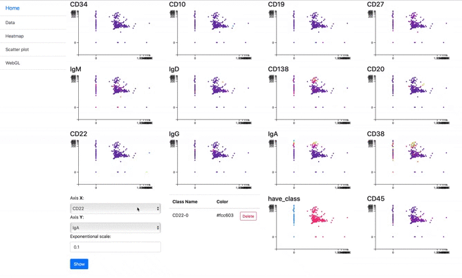
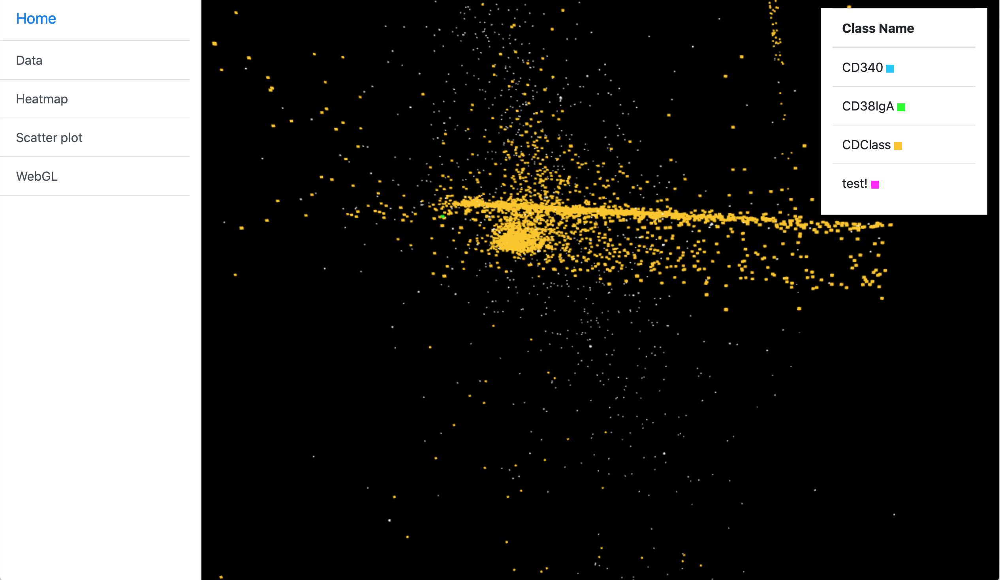
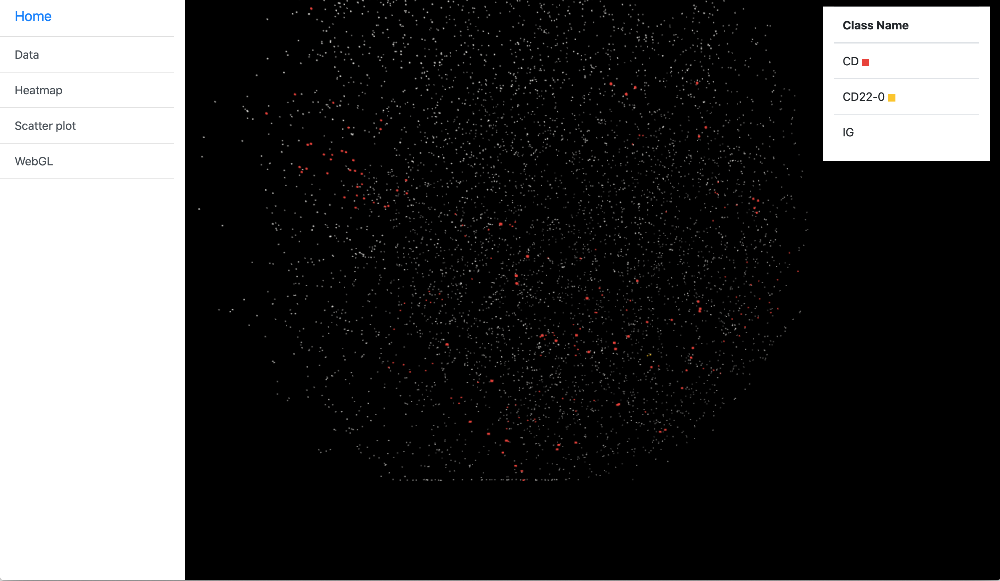

# Visualisation tool for Cytometric data analysis

This application is a tool for visualising and analysing cytometric data with different types of visualisations.

## Home - Data

Home screen provides management of data. 
There you can upload data in CSV format and named it. 
Each uploaded data file can be simply removed.
After uploading all your data click the button "Analyze".
This button runs a script to preprocessing and to analysing data for faster and better manipulation of the visualisations.

### Heatmap
Heatmap can shows us the main differences between clusters, compare attributes across clusters and view multiple statistics for a selected group. 
By clicking on the selected attribute you can see boxplots showing comparison of the attribute of the clusters.

### Scatter plot

In the scatter plot, the selected attributes are mapped to each other. 
Each scatter plot is cloured by corresponding attribute.
Points in the scatter plots represent clusters created with K-means algorithm.

This visualization allows users to manually select subsets of the clusters for closer analysis. 
With this solution, we address two problems.
The application enables to analyse individual clusters and a subset of clusters, and at the same time, the visualization provides an insight into the relationship of the selected attributes. 
Selected subsets of the clusters can be named and their colour can be assigned. 

### WebGL

Subsets of the clusters selected in the scatter plot view are visualized in 3D.  
Each point is coloured by assigned colour and transformed by tSNE or PCA algorithm to the 3D vectors.
In the view you can see grouped clusters in a bigger context, so you can analyse grouping in another point of view.

PCA | tSNE
:----------:|:----------:
  |  

## Built With

* [Django](https://docs.djangoproject.com/en/2.1/) - The web framework
* [Bootstrap](https://getbootstrap.com/docs/3.3/getting-started/) - CSS Framework
* [D3](https://github.com/d3/d3/wiki) - JavaScript library for visualizing data
* [Scikit-learn](https://scikit-learn.org/stable/index.html) Software machine learning library for the Python used to dimensionality reduction

The application was created as a school project for subject Data Visualization.

## Authors
- [Štefan Grivalský](https://www.linkedin.com/in/%C5%A1tefan-grivalsk%C3%BD-616628178/)
- [Ján Karaffa](https://www.linkedin.com/in/karaffajan/)